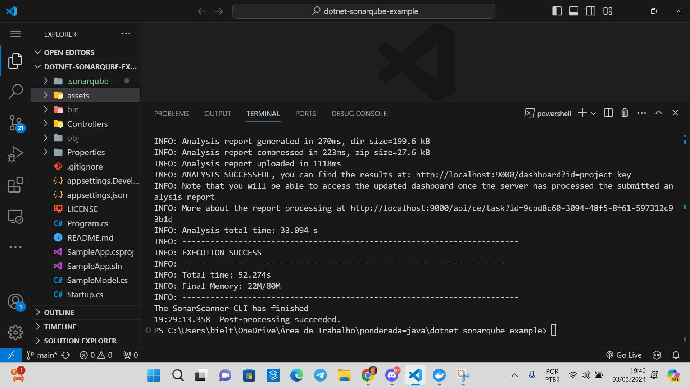
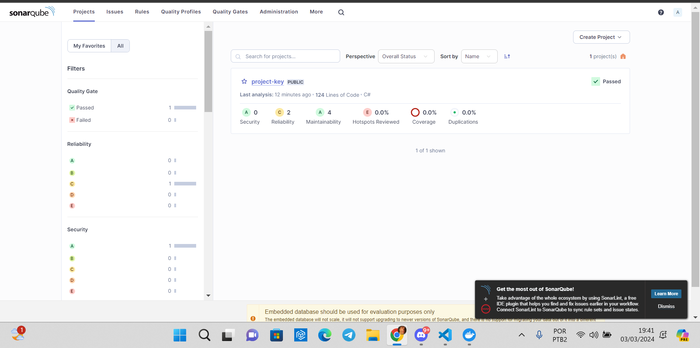
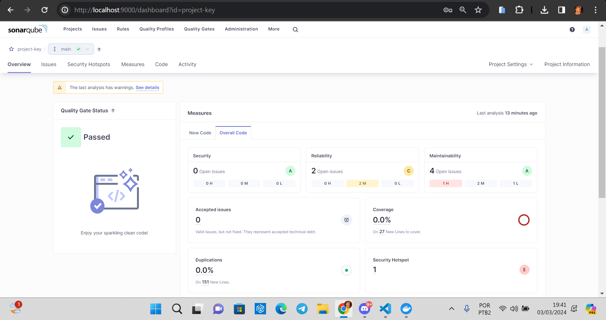
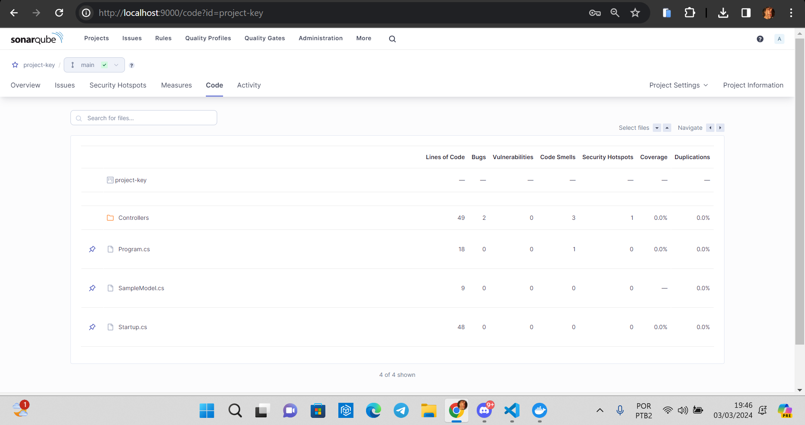
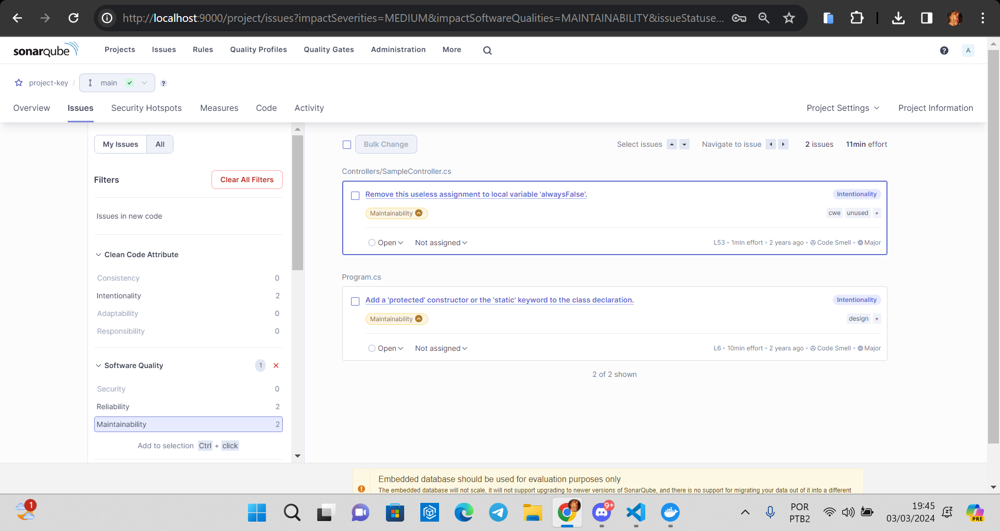
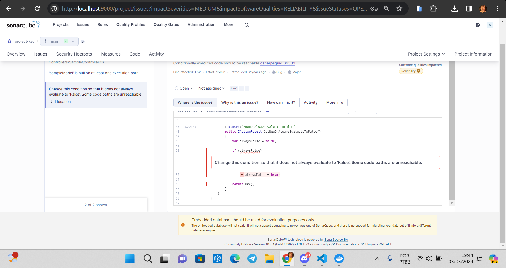
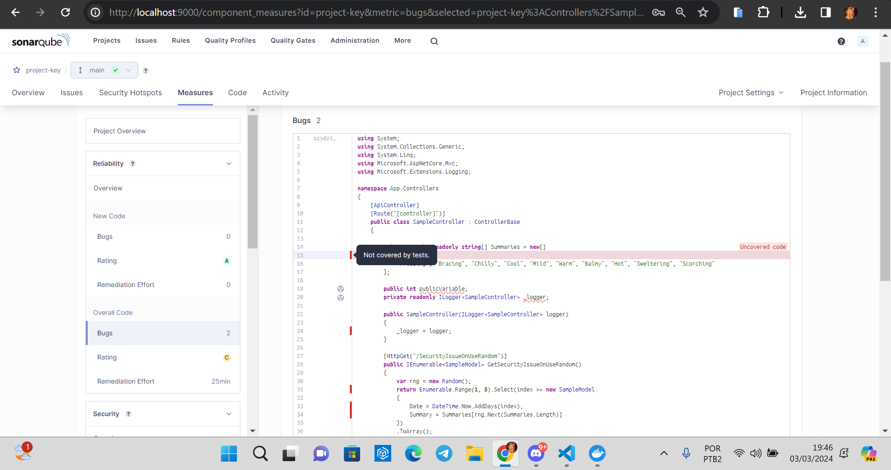

# Relatório sobre Como Escrever Código Mais Limpo e Seguro com SonarQube, Docker e .NET Core

Neste tutorial, é apresentado uma abordagem detalhada sobre como melhorar a qualidade e a segurança do código usando ferramentas como SonarQube, Docker e .NET Core. O artigo oferece uma visão geral abrangente de como essas tecnologias podem ser integradas para analisar e melhorar continuamente a qualidade do código de um aplicativo ASP.NET Core 3.0.

Ele enfatiza como o SonarQube pode identificar problemas de segurança e bugs complexos, oferecendo insights valiosos para os desenvolvedores. Além disso, destaca-se a capacidade do SonarQube de facilitar o planejamento e a alocação de tarefas, melhorando a colaboração entre os membros da equipe de desenvolvimento.

O tutorial explora os recursos-chave do SonarQube, incluindo o Quality Gate, que permite definir padrões de qualidade aceitáveis, e a análise gráfica do código, que fornece insights visuais sobre o progresso da codificação. Além disso, destaca-se a capacidade do SonarQube de identificar bugs, vulnerabilidades de segurança e duplicação de código, priorizando rapidamente as mudanças e melhorias necessárias.

Executando o código:

Entrando no SonarQube, podemos ver a tela principal com o Quality Gate afirmando que meu código passou!

Na parte de overview do sistema consigo ver a quantidade de issues que meu código tem, nesse caso, há 2 open issues na parte de Reilability e 4 em Maintainability.

Também, consigo analisar o código de forma mais geral. Vendo parâmetros como linhas de código e bugs em cada pasta do meu projeto.

Partindo para áreas mais específicas, consigo ter maiores detalhes sobre os issues do meu código.

Consigo ver possíveis bugs na parte de Measures e a avaliação fornecida pelo SonarQube

## Conclusão

O tutorial conclui destacando a importância da análise de código na produção de software de alta qualidade e seguro, enfatizando como o SonarQube pode ser um aliado valioso para os desenvolvedores, facilitando a identificação e correção de problemas no código. Gostei bastante da ferramenta! 
